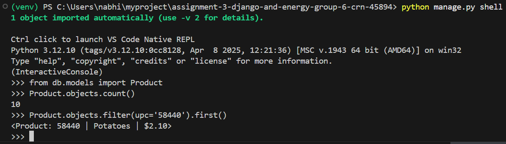
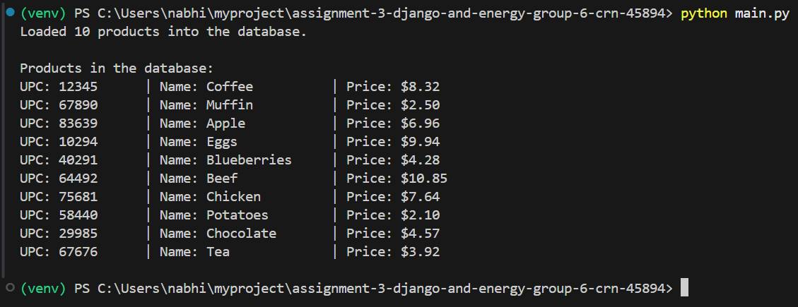
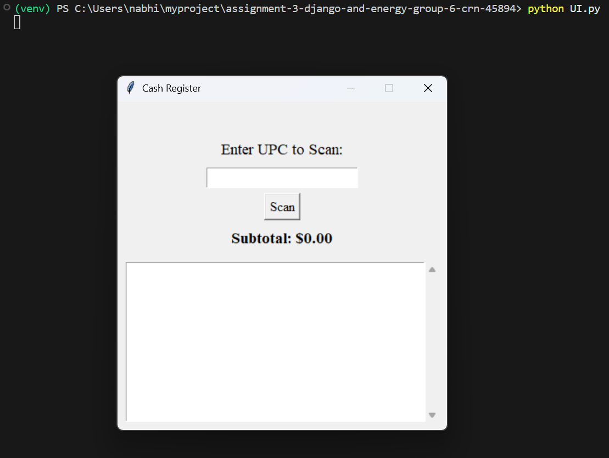
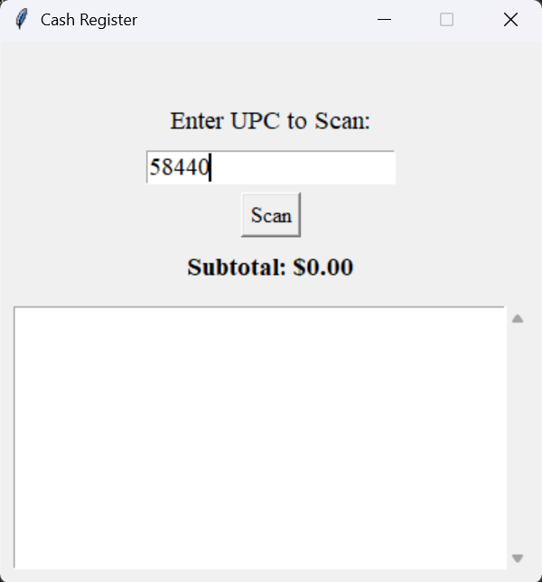
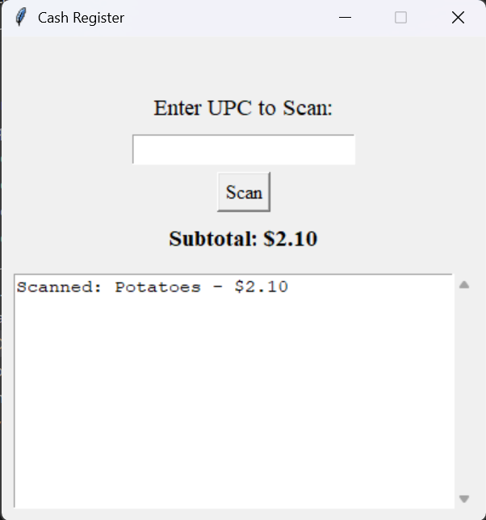
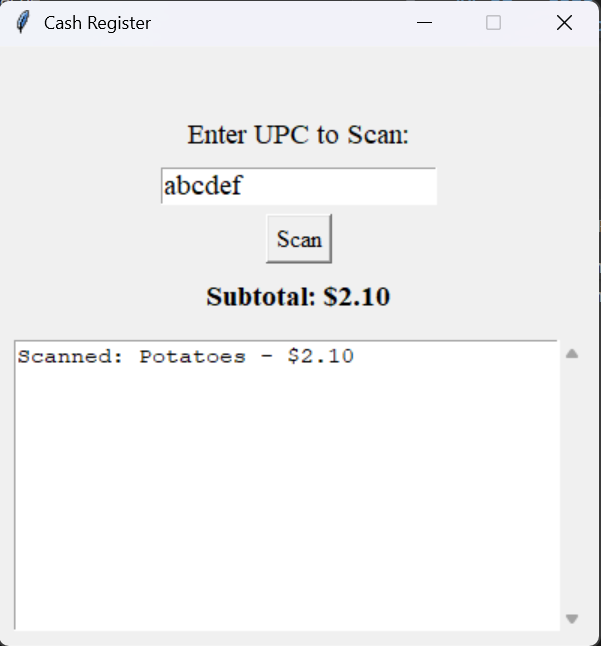
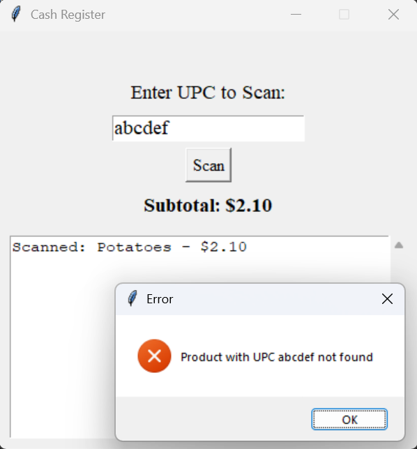
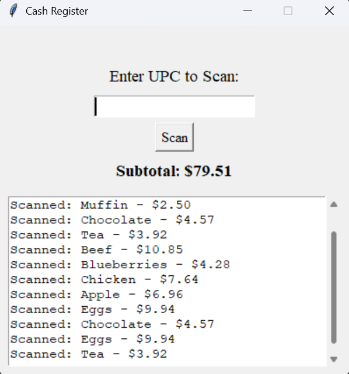

## Q1 — Code Organization & Django ORM

### Objective
This project uses the Django Object-Relational Mapper (ORM) to manipulate data using Python scripts and a Tkinter-based GUI. The overall functionality is similar to that of the implementation in Assignment 2, but this version loads all the products into a Django database and uses ORM queries to retrieve them. Users enter UPC codes and click the scan button (or press enter) to display their names and prices, as well as a running subtotal.

### Repository Structure

```
assignment-3-django-and-energy-group-6-crn-45894/
├── github/
├── db/
│   ├── __init__.py
│   └── models.py           # Django ORM model holding Product data (upc, name, price)
├── images/                 # Holds all output screenshots
├── venv/
│
├── Instructions.md         # Original project instructions (original README file text)
├── UI.py                   # Tkinter GUI for scanning UPCs and displaying product information
├── db.sqlite3              # SQLite database (auto-generated after migration)
├── main.py                 # Loads and displays product data from sampleproducts.txt into the
database
├── manage.py               # Django utility file (migration & setup commands)
├── sampleproducts.txt      # Source file holding product information (UPC code, name, price)
└── settings.py             # Django configuration (database, app registration)
```

### Repository Contents (Added Files)
- `db/models.py` — Product model (upc, name, price) using Django ORM.
- `main.py` - Main program - loads products into the databases and displays them in the terminal.
    - Initializes Django environment, reads products from sampleproducts.txt, displays products in the database
    - ORM operations used: Product.objects.update_or_create(), Product.objects.all()
- `UI.py` - Tkinter-based GUI program - scans upc codes and stores them in the database.
    - Error handling for invalid/missing UPCs, scrollable text area, dynamic subtotal label update
- `sampleProducts.txt` — List of product sample data including UPC code, name, and price.
- `Instructions.md ` - Assignment Part 1 instructions (originally the README file).
- `sampleproducts.txt` - List of sample products with upc, name, and price.
- `/images` - Folder containing all output screenshots - in this README as well.

### Environment Setup
1.  Open Terminal or Command Prompt.
2.  Go to the folder where you will store the project.
3.  Clone the repository
    ```bash
    git clone https://github.com/OTUSOFE365025/assignment-3-django-and-energy-group-6-crn-45894.git
    ```
4.  Navigate into the project directory
    ```bash
    cd assignment-3-django-and-energy-group-6-crn-45894
    ```
5.  `python -m venv venv`
6.  `venv\Scripts\activate` (Windows) OR `source venv/bin/activate` (macOS/Linux)
7.  `pip install django`
8.  `python manage.py makemigrations`
9.  `python manage.py migrate`

### Run Instructions
1. `python main.py`
2. `python UI.py`

### Django ORM Usage


This project showcases Django ORM usage in a standalone Python environment (no webserver). The operations below demonstrate the usage of Django ORM across the project files to perform application functionality.

#### ORM Operations Used
- Product.objects.update_or_create(upc=upc, defaults={'name': name, 'price': price})
    - Inserts new products
    - Updates existing records from the text file
- Product.objects.get(upc=upc)
    - Retrieve product details for a scanned UPC
- Product.objects.all()
    - List all stored products
- except Product.DoesNotExist:
    - Error handling for invalid UPC scans

Django ORM ensures data persistence between text data and the GUI. main.py imports data into the SQLite database while UI.py returns product information using ORM queries. Because all commands are object-based, no manual SQL queries are needed.

### Screenshots
Imported Products


Scanner UI


Successful Scan




Unsuccessful Scan




Scrollbar Functionality



